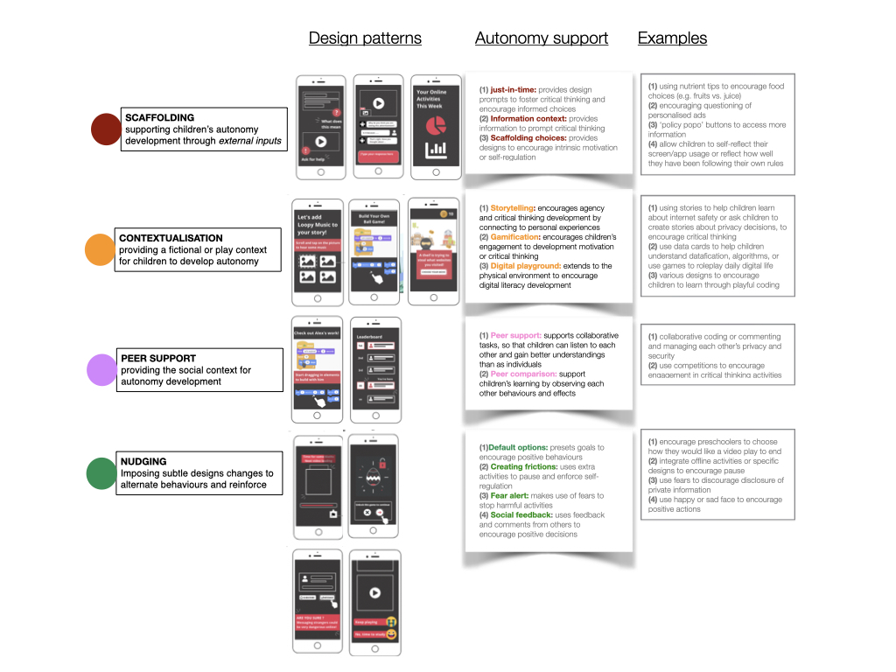

In this post, we examine current design principles aimed at fostering children’s autonomy in the digital context and highlight crucial gaps and important avenues for future developments. 
Autonomy is a complex concept; and children’s ability to exercise autonomy has been a topic of debate. We argue that the consideration of cognitive, behavioural and emotional autonomy provides a robust framework for designing support for children's autonomy. However, our review shows an imbalance in existing design patterns, with a stronger focus on cognitive and behavioural autonomy, and less on the effect on children’s reasoning and intrinsic motivation development. 
Furthermore, children’s autonomy is deeply intertwined with advocating for their rights in digital spaces. Thus, we examined recent ‘Child’s Rights by Design’ principles and identified children’s autonomy as fundamental to their rights. Building on this analysis, we propose a set of overarching principles for ‘Designing for Children’s Autonomy’. Informed by both theoretical insights into autonomy and practical experiences in digital contexts, these principles aim to offer a comprehensive framework for enhancing children's autonomy online.

# Introduction

In today’s rapidly evolving digital landscape, children's lives are increasingly shaped by Artificial Intelligence (AI) systems, which are integrated into various platforms such as connected toys, apps, voice assistants, and online learning platforms. While these systems hold promise for supporting children’s development and learning, they also pose significant risks due to the widespread collection and manipulation of children’s data, particularly impactful through the widely adopted AI-enabled learning systems and those involved in children’s social interactions and play.

Although children’s safety in their interactions with AI-based technologies has attracted increased concerns [1](https://ico.org.uk/media/for-organisations/guide-to-data-protection/key-data-protection-themes/age-appropriate-design-a-code-of-practice-for-online-services-2-1.pdf)[2](https://digitalfuturescommission.org.uk/wp-content/uploads/2022/06/Child-Rights-Impact-Assessment.pdf), current strategies mainly prioritise protection, often relying on tracking and monitoring technologies to shield children from harmful online content or contacts [3](https://oxfordccai.org/publication/journal-article-2021/), or adopting a parent/caregiver/educator-led approach to supervise children's online activities, sometimes without adequately supporting children developing the ability to navigate this intricate digital realm themselves.

A recent report [4]( https://www.internetmatters.org/hub/research/generative-ai-in-education-report/) highlighted the widespread integration of AI-based technologies in children's education, yet it reveals a lack of adequate support for both children and parents. Despite 54% of children using generative AI tools to enhance their learning at school, only 60% of schools have addressed the safe and effective use of AI with them. This highlights a critical  gap in supporting children's autonomy and agency when we are rapidly embracing the adoption of AI in their education.

Current design approaches, although aimed at safeguarding children's best interests, often unintentionally restrict their autonomy and impede their development. Both academic research and policy evidence indicate that the current emphasis on protection may be misplaced, highlighting the urgent need to reconsider how AI systems designed for children can more effectively prioritise their autonomy and development. This article reviews recent approaches to supporting children’s rights and autonomy, proposing seven principles for designing with children’s autonomy in mind.

# Children and Data Autonomy

Autonomy refers to an individual’s ability to make independent decision-making based on values [5](https://10.2307/2564674). Data Autonomy, in essence, encapsulates the empowerment and competence of individuals to comprehend, exercise control over, and reflect on the collection, processing, and inference of their data within the digital realm [6](https://doi.org/10.1145/3613904.3642294). This concept underscores the importance of informed understanding, active decision-making, and critical reflection in the way personal information is handled and utilised in online environments.

It is often believed that children lack the agency and ability to negotiate this sense of autonomy due to lack of knowledge, experience, or the ability of critical thinking. However, respecting children’s agency and autonomy is within their rights, and is provided within legal and medical frameworks. We acknowledge that children’s ability to recognise and exercise their autonomy can be influenced by their developmental stages and the broader socio-economic and political contexts of their lives. However, at the same time, we must reevaluate the necessity of fostering children’s agency and autonomy development in the digital context, as children are subject to constant data exploitations, and a protection- focused approach is insufficient to equip them with the essential skills and abilities. 

Some recent studies have explored the concept of designing for children’s autonomy, particularly by urging designers and innovators to avoid using dark patterns or persuasive designs [7](https://digitalfuturescommission.org.uk/guidance-for-innovators/). While we acknowledge the importance of this design guidance, we contend that supporting designs for children’s data autonomy requires a deeper understanding of what data autonomy means for children, and how digital designs can facilitate their development and exercise of data autonomy.

To achieve this objective, we first provide an overview of our current conceptualisation of autonomy for children in the digital context, along with existing design patterns for supporting children’s autonomy. We then use children's ‘Rights by Design’ principles to identify opportunities for designing for children’s autonomy and rights. Following this, drawing from our recent design experiences, we examine existing design principles and propose key areas for future development to ensure children's data autonomy.

# A conceptual framework of data autonomy for children
In philosophy, theories of autonomy are vast and multifaceted. Generally speaking, there are three main perspectives of autonomy theories that are particularly relevant to our discussion of children’s autonomy in the digital context, including a procedural perspective [8](https://doi.org/10.3402/nstep.v1.28479), which focuses on the decision-making process itself; a substantive perspective [9](https://doi.org/10.1093/oso/9780195123333.003.0001), considering the rationales and alignment of decision content with personal values and identity; and a relational and communal perspective [10](https://doi.org/10.2979/intjfemappbio.5.2.11), which recognises the influence of social interactions on our choices, emphasising self-determination, self-governance, and self-authorisation. 

Researchers have further distilled these complex theories of autonomy into three more accessible forms [11](https://oxfordccai.org/publication/conference-paper-2023-2/)tailored to adolescence and frequently described autonomy through the following three forms:
- **Cognitive Autonomy**, an individual's ability to think independently, critically evaluating thoughts; 
- **Behavioral Autonomy**, the capacity to act on personal judgement, making decisions independently; 
- **Emotional Autonomy**, an individual's ability to manage their emotions independently.

These perspectives on autonomy, grounded in philosophical tradition, continue to evolve in modern contexts such as social media. In the following, we use this working definition to analyse current design support for the development of children’s autonomy.

# Current HCI design approaches to support children’s autonomy

While autonomy is recognised to be critical to children’s development into adulthood, existing designs have not always been grounded upon a consistent conceptualisation of autonomy. As a result, in 2022, we conducted a systematic review of designing for children’s autonomy in the literature of HCI over the last decade [11]. It identified a good set of design patterns that have been explored in the previous work that could helpfully inform our design for supporting children’s autonomy in the digital context.

These design mechanisms fall into FOUR groups, as shown in the figure below:
- SCAFFOLDING: provides support for children’s autonomy development through external inputs, such as JUST-IN-TIME prompts, INFORMATION CONTEXT, or mechanisms to SCAFFOLD CHOICES.

- CONTEXTUALISATION: provides a fictional or play context for children to develop autonomy, breaking down complex concepts into entities that are more approachable to children

- PEER SUPPORT, provides the social context for autonomy development

- NUDGING: imposes subtle designs changes to alternate behaviours and reinforce positive ones

  
  <em>Design caption="An overview of design mechanisms used for support children’s autonomy in existing HCI literature[11]</em>

It was interesting to see that 1) the majority of the designs have focused on supporting children’s critical thinking, or cognitive autonomy, in their decision-making process by providing information, peer collaboration or comparison; 2) Nudege-based designs, such as scaffolding of choices and gamification, have been largely used to encourage behaviour change, while made little discussions of whether such behaviour changes are linked to any effect on children's motivation and rationale development; 3) finally, contextualisation techniques like Storytelling or Digital playground have often been used to foster children’s digital literacy development,  for example, by connecting their physical experiences with digital ones, which consequently support their ability of critical thinking.

This collection of design patterns offers a strong foundation for designing autonomy support for children in the digital context, with many showing promising results. However, the analysis above indicates that most approaches **primarily target at supporting children's cognitive and behavioural autonomy**. Yet, their impact on enhancing children's intrinsic motivation and self-regulation development remains somewhat uncertain.

# Rights by Design

Autonomy is core to children’s rights to agency and flourishment. While child-centred design has been extensively researched, designing for children’s rights has been less examined. 

The Rights by Design framework [12](https://childrightsbydesign.digitalfuturescommission.org.uk) from the Digital Future Commissions presents 11 design principles to encourage innovators to build digital products that support children’s rights in the digital environment. Together, they provide a comprehensive guidance for innovators to carefully consider children’s diverse needs (equality), best interests, how to best include children’s voices, ensuring age-appropriateness of the technologies.

While these principles were not specifically designed to support children’s autonomy development, we recognise that they provide a valuable framework for supporting autonomy development. 

While these principles were not specifically designed to support children’s autonomy development, we recognise that they provide a valuable framework for supporting autonomy development. 

For example, as shown in the summary table below:
- Ensuring EQUITY, AGE APPROPRIATENESS, PRIVACY, and SECURITY of children would be essential when designing new ways to foster children’s autonomy development.
- At the same time, considering children’s equal partnership in our design process (CONSULTATION) is aligned with our principle of respecting children’s rights and best interests. 

Notably, while AGENCY was included as a key principle in the design framework, we recognise its greater emphasis on minimising harms to children’s agency, rather than actively fostering children’s agency development. Children’s development of agency and autonomy is a complex process, involving not only cognitive, behavioural, and emotional aspects but also a process of motivation building that leads to a deeper sense of autonomy. Design support for all these facets thus demands more thorough consideration. 

| 
Children’s rights by design  principles
  | 
Design purposes
| 
Design examples
 | 
Relationship with children’s autonomy development
|
| -------- | ------- | -------- | ------- |
| **Equity and diversity**  | Be inclusive, treating everyone fairly and provide for diverse needs and circumstances, despite of sex, disability, socioeconomic background, ethnic or national origin, language or any other grounds (e.g., typical protected characteristics) |<ul> <li>Minimising content reinforcing prejudices about a particular group of children</li><li>Minimising cost and cultural barriers, and prioritise digital features that are inclusive, accessible and welcoming to all. </li><li>Including an easily accessible pathway for children and their parents or caregivers to object to automated decisions</li></ul> | A fundamental  design consideration  when designing for children’s autonomy and agency |
|**Best interests**| Provide equal consideration to children’s wellbeing, growth, development and agency as to businesses’ interests |Digital providers often claim that they cannot identify the age of their users or distinguish children from adults, and as a result, build products that neglect children’s diverse needs and vulnerabilities | Children’s agency is part of their best interests |
|**Consultation**| Engage and listen to the views of children in product development and design | Consultation with children should be ‘transparent and informative, voluntary, respectful, relevant [to the child], child-friendly, inclusive, supported by training, safe and accountable’ | The approach of treating children as ‘research partners’ is a shared principle in the process of designing for children’s agency |
|**Age appropriate**|Design products that are age appropriate, considering children’s developmental milestones and life circumstances | <ul><li>Having in place age-assurance mechanisms or age gating to prevent access or usage by underage users of high-risk products or services.</li><li>Prioritising features, functionality, content and business models that are compatible with children’s evolving capacities and agency</li></ul>| Age appropriateness is another critical design consideration when ensuring agency fostering designs |
|**Responsible**|Businesses should keep up with ethical, rights-based and legal frameworks and guidance so that children’s digital lives are enabled and empowered by design | <ul><li>Know of and comply with laws, regulations, industry standards and other measures to ensure the realisation of children’s rights</li><li>Provide children with accessible and safe pathways to meaningful remedies if things go wrong.</li></ul>|Similar to ‘consultation’, responsible innovation is another critical principle in the process of ensuring agency fostering designs|
|**Participation**|Create opportunities for children to form opinions, impart and receive diverse information, and freely join social and political activities | <ul><li>Children’s participation can be undermined by surveillance or the use of AI-driven recommendation systems that filter, select and serve information to a child in restrictive or distorting ways, or even destructive ways</li><li>Children's  experience of online inhibits their freedom of expression, information, assembly and association</li></ul>|Creating opportunities to participate, express and access to information is critical both to the process of design for agency and a critical design consideration for creating agency-foster services/technologies.|
|**Privacy**|Provide design features that give users meaningful control over the visibility, access and use of personally identifiable data.| Designs should consider minimise different types of privacy risks for children: <ul><li>interpersonal privacy: data-based recommendations of friends or contact or threats from parental control apps</li><li>institutional privacy: processing of data about children by public authorities, such as schools, and the onward sharing of data with other public and private stakeholders</li><li>commercial privacy: profiling users’ data to inform design decisions to prolong user engagement, manipulate users’ behaviours or serve users with targeted marketing or other forms of data monetisation</li></ul>|Respecting children’s data privacy and supporting them is a fundamental design consideration of supporting children’s autonomy|
|**Safety**|Take preventive measures proportionate to the risks, without being at the cost of children’s full enjoyment of the digital environment and other rights.|<ul><li>Mitigate the risks associated with harmful content and cyberbullying</li><li>Employ moderation mechanisms with care</li></ul>|Keeping children safe online is fundamental to their development of autonomy, while fostering children’s autonomy would strengthen their ability to stay safe online|
|**Wellbeing**|Enhance and do not harm the health and wellbeing of all children, including through design choices that  promote a balanced lifestyle, emotional regulation and supportive social connections.| <ul><li>Use data-driven algorithms to improve children’s social care and safeguarding decisions, while with mechanisms that mitigate false positive or false negative results and bias in the datasets.</li><li>Avoid design options that undermine children’s social relationships, disrupt healthy routines or manipulate their choices to their detriment.</li><li>Recognises and accommodates special requirements of children with disabilities, promoting diversity, equity and inclusion. </li><li>Promote healthy and balanced lifestyles by providing easy access to health information and health and social services, encouraging active living (e.g., hybrid games that promote physical exercise) and offering creative opportunities (e.g., a sandbox game).</li><li>Refrain from deploying design features that cultivate compulsion (e.g., excessive gamification techniques), are detrimental to children’s relations with others, or are disruptive of a healthy routine.</li></ul>|Supporting children’s autonomy is expected to enhance their general well-being, particularly related to a more healthy social relationship and lifestyle; at the same time, we could draw analogies from many of the design approaches for enhancing children’s well-being to ensure children’s autonomy development |
|**Development**|Enable children’s learning, free play, sociability and belonging, and their fullest development, encouraging imagination, educational opportunities of all kinds | <ul><li>Provide child-friendly terms of service and transparency</li><li>Provide effective support and systems for reporting and managing content, contact, conduct and contract risks, helping children develop key digital competencies</li><li> Allow for experimentation, recognis[ing] that exploration, invention and a degree of risk taking</li></ul>|Children’s autonomy development is essential to their transition to adulthood and their general development|
|**Agency**|Support child users’ decision-making and reduce exploitative features and business models that harm their agency|<ul><li>Avoid manipulating children’s decisions.</li><li>Prioritise design features that put children in charge of their digital experiences, and be upfront about their commercial intents</li></ul>|The development of agency is a complex process and may require nuanced support for children’s recognition of decision-making opportunities and for their development of motivations|
: 11 Principles of Design for Children’s Rights and how they related to supporting children’s autonomy

