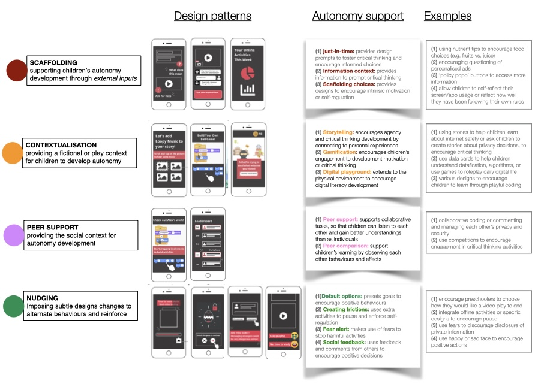

In this post, we examine current design principles aimed at fostering children’s autonomy in the digital context and highlight crucial gaps and important avenues for future developments. 
Autonomy is a complex concept; and children’s ability to exercise autonomy has been a topic of debate. We argue that the consideration of cognitive, behavioural and emotional autonomy provides a robust framework for designing support for children's autonomy. However, our review shows an imbalance in existing design patterns, with a stronger focus on cognitive and behavioural autonomy, and less on the effect on children’s reasoning and intrinsic motivation development. 
Furthermore, children’s autonomy is deeply intertwined with advocating for their rights in digital spaces. Thus, we examined recent ‘Child’s Rights by Design’ principles and identified children’s autonomy as fundamental to their rights. Building on this analysis, we propose a set of overarching principles for ‘Designing for Children’s Autonomy’. Informed by both theoretical insights into autonomy and practical experiences in digital contexts, these principles aim to offer a comprehensive framework for enhancing children's autonomy online.

# Introduction

In today’s rapidly evolving digital landscape, children's lives are increasingly shaped by Artificial Intelligence (AI) systems, which are integrated into various platforms such as connected toys, apps, voice assistants, and online learning platforms. While these systems hold promise for supporting children’s development and learning, they also pose significant risks due to the widespread collection and manipulation of children’s data, particularly impactful through the widely adopted AI-enabled learning systems and those involved in children’s social interactions and play.

Although children’s safety in their interactions with AI-based technologies has attracted increased concerns [1](https://ico.org.uk/media/for-organisations/guide-to-data-protection/key-data-protection-themes/age-appropriate-design-a-code-of-practice-for-online-services-2-1.pdf)[2](https://digitalfuturescommission.org.uk/wp-content/uploads/2022/06/Child-Rights-Impact-Assessment.pdf), current strategies mainly prioritise protection, often relying on tracking and monitoring technologies to shield children from harmful online content or contacts [3](https://oxfordccai.org/publication/journal-article-2021/), or adopting a parent/caregiver/educator-led approach to supervise children's online activities, sometimes without adequately supporting children developing the ability to navigate this intricate digital realm themselves.

A recent report [4]( https://www.internetmatters.org/hub/research/generative-ai-in-education-report/) highlighted the widespread integration of AI-based technologies in children's education, yet it reveals a lack of adequate support for both children and parents. Despite 54% of children using generative AI tools to enhance their learning at school, only 60% of schools have addressed the safe and effective use of AI with them. This highlights a critical  gap in supporting children's autonomy and agency when we are rapidly embracing the adoption of AI in their education.

Current design approaches, although aimed at safeguarding children's best interests, often unintentionally restrict their autonomy and impede their development. Both academic research and policy evidence indicate that the current emphasis on protection may be misplaced, highlighting the urgent need to reconsider how AI systems designed for children can more effectively prioritise their autonomy and development. This article reviews recent approaches to supporting children’s rights and autonomy, proposing seven principles for designing with children’s autonomy in mind.

# Children and Data Autonomy

Autonomy refers to an individual’s ability to make independent decision-making based on values [5](https://10.2307/2564674). Data Autonomy, in essence, encapsulates the empowerment and competence of individuals to comprehend, exercise control over, and reflect on the collection, processing, and inference of their data within the digital realm [6](https://doi.org/10.1145/3613904.3642294). This concept underscores the importance of informed understanding, active decision-making, and critical reflection in the way personal information is handled and utilised in online environments.

It is often believed that children lack the agency and ability to negotiate this sense of autonomy due to lack of knowledge, experience, or the ability of critical thinking. However, respecting children’s agency and autonomy is within their rights, and is provided within legal and medical frameworks. We acknowledge that children’s ability to recognise and exercise their autonomy can be influenced by their developmental stages and the broader socio-economic and political contexts of their lives. However, at the same time, we must reevaluate the necessity of fostering children’s agency and autonomy development in the digital context, as children are subject to constant data exploitations, and a protection- focused approach is insufficient to equip them with the essential skills and abilities. 

Some recent studies have explored the concept of designing for children’s autonomy, particularly by urging designers and innovators to avoid using dark patterns or persuasive designs [7](https://digitalfuturescommission.org.uk/guidance-for-innovators/). While we acknowledge the importance of this design guidance, we contend that supporting designs for children’s data autonomy requires a deeper understanding of what data autonomy means for children, and how digital designs can facilitate their development and exercise of data autonomy.

To achieve this objective, we first provide an overview of our current conceptualisation of autonomy for children in the digital context, along with existing design patterns for supporting children’s autonomy. We then use children's ‘Rights by Design’ principles to identify opportunities for designing for children’s autonomy and rights. Following this, drawing from our recent design experiences, we examine existing design principles and propose key areas for future development to ensure children's data autonomy.

# A conceptual framework of data autonomy for children
In philosophy, theories of autonomy are vast and multifaceted. Generally speaking, there are three main perspectives of autonomy theories that are particularly relevant to our discussion of children’s autonomy in the digital context, including a procedural perspective [8](https://doi.org/10.3402/nstep.v1.28479), which focuses on the decision-making process itself; a substantive perspective [9](https://doi.org/10.1093/oso/9780195123333.003.0001), considering the rationales and alignment of decision content with personal values and identity; and a relational and communal perspective [10](https://doi.org/10.2979/intjfemappbio.5.2.11), which recognises the influence of social interactions on our choices, emphasising self-determination, self-governance, and self-authorisation. 

Researchers have further distilled these complex theories of autonomy into three more accessible forms [11](https://oxfordccai.org/publication/conference-paper-2023-2/)tailored to adolescence and frequently described autonomy through the following three forms:
- **Cognitive Autonomy**, an individual's ability to think independently, critically evaluating thoughts; 
- **Behavioral Autonomy**, the capacity to act on personal judgement, making decisions independently; 
- **Emotional Autonomy**, an individual's ability to manage their emotions independently.

These perspectives on autonomy, grounded in philosophical tradition, continue to evolve in modern contexts such as social media. In the following, we use this working definition to analyse current design support for the development of children’s autonomy.

# Current HCI design approaches to support children’s autonomy

While autonomy is recognised to be critical to children’s development into adulthood, existing designs have not always been grounded upon a consistent conceptualisation of autonomy. As a result, in 2022, we conducted a systematic review of designing for children’s autonomy in the literature of HCI over the last decade [11]. It identified a good set of design patterns that have been explored in the previous work that could helpfully inform our design for supporting children’s autonomy in the digital context.

These design mechanisms fall into FOUR groups, as shown in the figure below:
- SCAFFOLDING: provides support for children’s autonomy development through external inputs, such as JUST-IN-TIME prompts, INFORMATION CONTEXT, or mechanisms to SCAFFOLD CHOICES.

- CONTEXTUALISATION: provides a fictional or play context for children to develop autonomy, breaking down complex concepts into entities that are more approachable to children

- PEER SUPPORT, provides the social context for autonomy development

- NUDGING: imposes subtle designs changes to alternate behaviours and reinforce positive ones

  

