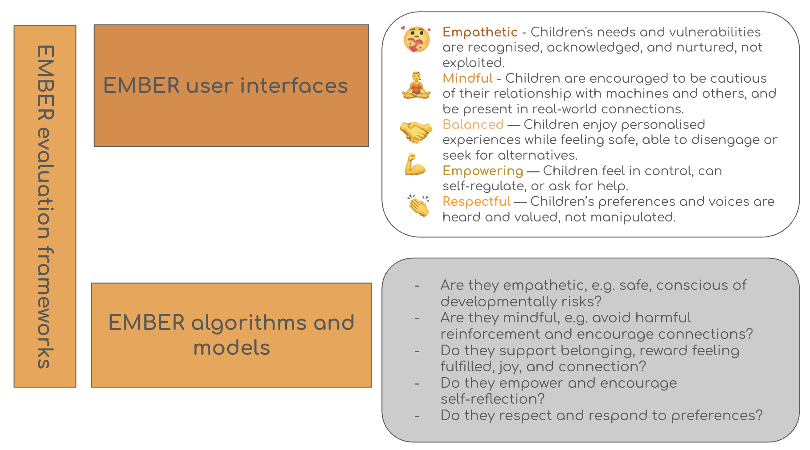

We would like to present a vision statement about our roadmap of desiging for ethical machines for children in 2026-2030.

# Why

From 2015-2020, we focused on understanding how young children, aged 7-11, navigate data privacy online and how we can better support them. This led to the creation of our [KOALA Hero app and toolkit](https://oxfordccai.org/project/koala/), which helps parents and children to use the toolkit together to discuss data privacy risks associated with the apps they use on their mobile devices and how to make informed choices.

From 2021-206, we established the increased confidence in our understanding of how children of this age group talk about data privacy risks and their ownership of their data online. We were pleased to notice their nuanced perceptions about data autonomy. Working with older children and comparing their perceptions with the younger age group, we recognised a strong desire for children to have better control of their data. This led to the creation of our [CHAITok app](https://oxfordccai.org/research/agency/), mimicking the experience of using TikTok but with a much better control of their data.

While these research experiences have given us deep insights of children lived experiences with digital technologies, we realised that there are few ethical options for them, to enjoy and benefit from these digital technologies while avoiding being exposed to algorithmic manipulations, addictions, and associated social anxieties. The rise of generative AI in early 2024 to the general public further exacerbated the situation and the opportunity for children could flourish in a digital childhood, rather than being exploited in.

# What is EMBER?

EMBER aims to create emphathetic and respectful AI technologies for children (anyone under 18) so that they can grow up safely and retain their agency as humans. We want to create EMBER technologies that reflect the following principles:
- Empathetic - children's needs and vulnerabilities are recognised, acknowledged, and nurtured, not epxloited.
- Mindful - children are given space to develop self-regulation, agency, and the confidence to explore
- Belonging — children feel fulfilled, joyful, and connected to themselves, others, and nature
- Empowered — children feel in control, can take pauses, choose alternatives, or ask for help
- Respectful — children's preferences and voices are heard, not manipulated

We envision EMBER needs to be implemented both at the algorithmic and user experience levels:
- We need to create AI models or agentic networks that are EMBER
- We need to create user interfaces that are EMBER

  
  <em>Implementing EMBER machinese for children</em>

# How can an EMBER application look like?

In the next blog post, we will walk through the useful child-centred scenarios developed by [KORA](https://korabench.ai) and show how an EMBER AI not only provides a safer option for children, but also more empathetic, mindful, creating belonging, empowering, and reflectful.
