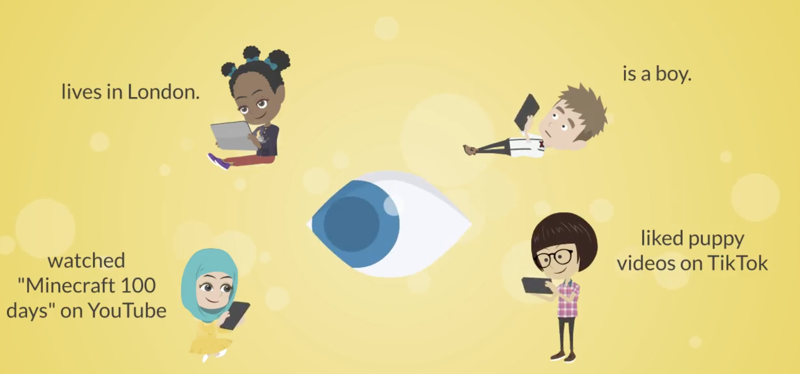

We are launching a new research study with children aged 13-15 this summer!

Ever wonder what determines what your teenager sees on TikTok, Instagram, or Netflix?

  
  <em>Design caption="Children, data, and their agency"</em>

Researchers at Oxford Computer Science have developed some special social media apps that can help children learn how their data is used by existing social media platforms, and how they can take better control of their data.  

This summer, we're looking for families with teens aged 13-16 to join our research study. Children will try out two fun and easy-to-use apps — CHAITok and CHAIFlix — designed to help children better understand and manage their personal data on social media.

- Who: Families with teens ages 13-16
- What: A research session exploring children's personal data on social media platforms
- Why: To give teen insight into the invisible forces shaping young people's digital experiences

To the join the study and help your child understand better the digital world they navigate every day, [register your interest here](https://app.onlinesurveys.jisc.ac.uk/s/oxford/chai-media-sign-up-form).
